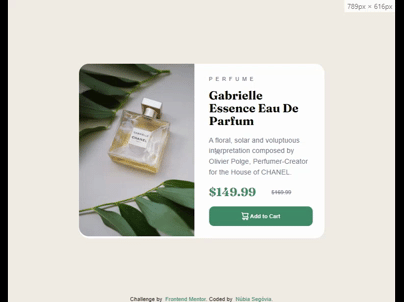

# Frontend Mentor - Product preview card component solution

This is a solution to the [Product preview card component challenge on Frontend Mentor](https://www.frontendmentor.io/challenges/product-preview-card-component-GO7UmttRfa). Frontend Mentor challenges help you improve your coding skills by building realistic projects.

## Table of contents

- [Frontend Mentor - Product preview card component solution](#frontend-mentor---product-preview-card-component-solution)
  - [Table of contents](#table-of-contents)
    - [The challenge](#the-challenge)
    - [Screenshot](#screenshot)
    - [Preview](#preview)
    - [Desktop design](#desktop-design)
    - [Mobile design](#mobile-design)

### The challenge

Users should be able to:

- View the optimal layout depending on their device's screen size
- See hover and focus states for interactive elements

### Screenshot

### Preview

[Live Preview](https://nubiasegovia.github.io/perfume-preview-card-component/)

### Desktop design

### Mobile design

